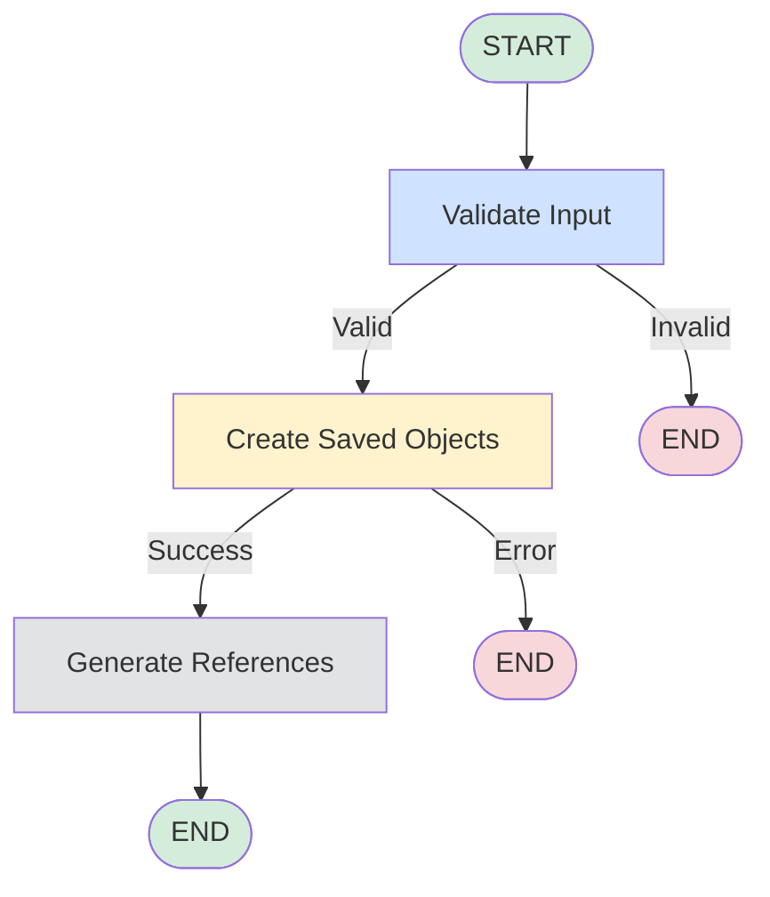

# Saved Objects Creation LangGraph

This directory contains the LangGraph implementation for creating saved objects in Kibana.

## Architecture

The saved objects creation workflow is modeled as a **state graph** with multiple nodes representing distinct steps in the creation process.

### Graph Flow



### State Structure

The graph maintains state throughout execution:

```typescript
{
  // Input
  savedObjects: SavedObjectsBulkCreateObject[],
  spaceId: string,

  // Processing
  validated: boolean,
  validationErrors: string[],

  // Output
  result: SavedObjectsBulkResponse | null,
  references: string[],
  error: string | null
}
```

## Node Descriptions

### 1. **validate** Node
- **Purpose:** Validates input saved objects before creation
- **Checks:**
  - At least one object provided
  - Required fields present (`type`, `attributes`)
  - Valid references structure
  - Namespace constraints
- **Output:** `validated: true/false` + `validationErrors: string[]`

### 2. **create** Node
- **Purpose:** Calls `savedObjectsClient.bulkCreate()`
- **Behavior:**
  - Creates all objects in a single bulk operation
  - Handles partial failures gracefully
  - Captures errors without throwing
- **Output:** `result: SavedObjectsBulkResponse` or `error: string`

### 3. **references** Node
- **Purpose:** Generates content reference strings for tracking
- **Behavior:**
  - Filters successful creations
  - Creates reference IDs (`type:id` format)
  - Prepares for content store registration
- **Output:** `references: string[]`

## Conditional Routing

### After Validation
```typescript
if (state.validated) → 'create'
else → END
```

### After Creation
```typescript
if (state.error) → END
else → 'references'
```

## Benefits of LangGraph Approach

### 1. **Explicit State Management**
- All intermediate state is tracked and accessible
- Easy to debug by inspecting state at each node
- Can resume from checkpoints if needed

### 2. **Separation of Concerns**
- Each node has a single responsibility
- Validation logic isolated from creation logic
- Easy to test nodes independently

### 3. **Error Handling**
- Errors don't crash the graph
- Can route to different paths based on error types
- Full error context preserved in state

### 4. **Observability**
- Can add logging/telemetry at each node
- State transitions are explicit
- Easy to add APM tracing per node

### 5. **Extensibility**
- New nodes can be added without touching existing code
- Can add parallel branches for different object types
- Can insert middleware nodes for authorization checks

## Usage Example

```typescript
// Create the graph
const graph = await getSavedObjectsCreationGraph({
  savedObjectsClient,
  logger,
});

// Invoke with initial state
const result = await graph.invoke({
  savedObjects: [
    {
      type: 'dashboard',
      attributes: { title: 'My Dashboard' },
    }
  ],
  spaceId: 'default',
});

// Check final state
if (result.validated && result.result) {
  console.log('Success:', result.result.saved_objects);
} else {
  console.error('Error:', result.error || result.validationErrors);
}
```

## Comparison: LangChain Tool vs LangGraph

### Before (LangChain Tool)
```typescript
async (input) => {
  const result = await savedObjectsClient.bulkCreate(input.savedObjects);
  return JSON.stringify(result);
}
```

**Issues:**
- No validation before API call
- Errors crash the tool
- No intermediate state tracking
- Hard to debug failures

### After (LangGraph)
```typescript
const finalState = await graph.invoke({
  savedObjects: input.savedObjects,
  spaceId,
});

// Full state available: validation, result, errors, references
```

**Benefits:**
- Pre-flight validation
- Graceful error handling
- Full execution trace
- Easy to extend

## Testing Strategy

### Unit Tests
```typescript
describe('validateSavedObjects', () => {
  it('rejects empty input', async () => { /* ... */ });
  it('validates references structure', async () => { /* ... */ });
});

describe('createSavedObjects', () => {
  it('calls bulkCreate with correct params', async () => { /* ... */ });
  it('handles creation errors', async () => { /* ... */ });
});
```

### Integration Tests
```typescript
describe('getSavedObjectsCreationGraph', () => {
  it('executes full workflow', async () => {
    const graph = await getSavedObjectsCreationGraph({ /* ... */ });
    const result = await graph.invoke({ /* ... */ });
    expect(result.validated).toBe(true);
    expect(result.result).toBeDefined();
  });
});
```

## Future Enhancements

1. **Parallel Creation**: Split large batches across parallel nodes
2. **Rollback on Failure**: Add compensation logic for partial failures
3. **Authorization Checks**: Insert node to validate user permissions per object type
4. **Telemetry**: Add metrics collection at each state transition
5. **Streaming**: Stream intermediate results back to UI
6. **Retry Logic**: Add exponential backoff for transient errors
